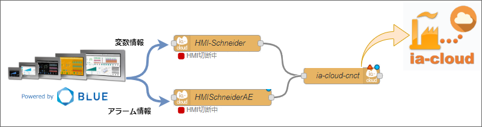
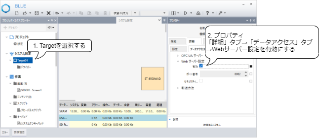

# HMI-Schneider通信機器関連ノード

## 機能概要

これら一連のノードは、シュナイダーエレクトリック製のHMI(BLUEソフトウェア)とのWebSocket通信を行い、HMIが保持するデータ情報を受信して、ia-cloud Center Server(CCS)へ格納するオブジェクトを生成して出力メッセージとして送出します。

### BLUEでの設定

Targetプロパティ「詳細」タブ→「データアクセス」タブ→Webサーバー設定を有効にしてください。

#### 制限事項

- 本ノードはWebサーバー設定の「セキュリティ設定」には対応していません。「セキュリティ設定」を有効にした場合、通信ができませんのでご注意ください。

### HMI-Schneiderノード

HMI上の変数の状態変化を受信し、ia-cloudオブジェクトを生成するNodeです。  
[HMI-Schneiderの詳細](readme-HMI-Schneider.md)

### HMI-Schneider-AEノード

HMI上のアラームの発生・復旧情報を受信し、アラーム＆イベント情報を持つia-cloudオブジェクトを生成するNodeです。  
[HMI-Schneider-AEの詳細](readme-HMI-Schneider-AE.md)
