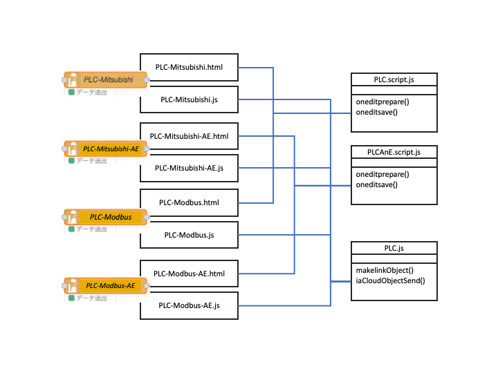

# PLCデータノード

## PLC-Modbus、PLC-Mitsubishi, PLC-Modbus-AE、PLC-Mitsubishi-AE
Modbus通信機器の持つビットデータ・ワードデータを読み出し、ia-cloudオブジェクトを生成するNode。
Bitデータ、数値データ、文字列データ、数値列データの自由な組合せオブジェクトを生成する、  
* PLC-Modbus
* PLC-Mitsubishi  
の二つの、PLCデータNodeと、  

PLCのBitデバイスの状態から、ia-cloudアラーム＆イベントオブジェクトを生成する  

* PLC-Modbus-AE
* PLC-Mitsubishi-AE  
の二つのPLCアラーム＆イベントNodeがある。

いずれのNodeも、設定NodeとしてModbus-comあるいは、Mitsubisi-comを使用する。   
またこれらのNodeは、UI画面のスクリプト処理が非常に似通っていることから、PLC-Modbus nodeと PLC-Mitsubishi node のUI画面のスクリプト処理の共通部分をモジール化した、　　

* PLC.script.js

および、PLC-Modbus-AE nodeと PLC-Mitsubishi-AE node のUI画面のスクリプト処理の共通部分をモジール化した、  

* PLCAnE.script.js

を利用する構成となっている。また、Nodeｍの実行時の内部処理も共通部分が多いことから共通部分をクラス化してこの共通クラスを拡張しそれぞれで使用する構成となっている。このクラス定義のモジュールが、  

* PLC.js

である。このベースクラスは、PLC-Modbus、PLC-Modbus-AE、PLC-Mitsubushi、PLC-Mitsubishi-AEのNodeで拡張し使用される。  
以下に構成図を示す。



## 入力メッセージ
ia-cloudオブジェクトを送出するタイミングを指示するメッセージ

| 名称 | 種別 | 説明 |
|:----------|:-----:|:--------------------|
|payload|string|NULL, 0, false 以外の時、その時点でのia-cloudオブジェクトを生成して出力する。主にデバッグ用途| 

## 出力メッセージ
オブジェクトのia-cloud CSへストアーするためのメッセージを出力する。ia-cloud-cnct Nodeへの接続を想定している。

| 名称 | 種別 | 説明 |
|:----------|:-----:|:--------------------|
|request|string|"store"|
|dataObject|object|ストアするia-cloudオブジェクト|  
|payload|object|ia-cloudオブジェクト内のcontentData[]の参照|  

サンプル
```
msg = {
  request: "store",
  dataObject: {
    objectKey: "com.ia-cloud.........",
    objectType: "iaCloudObject",
    timestamp: "",
    objectDescription: "説明",
    ObjectContent: {
      contentType: "iaCloudData",
      contentData: [{
        dataName
                .
                .
                .
      }]
    }
  },
  payload: contentData
}
```
## プロパティー

本nodeは以下のプロパティを持つ。各Nodeのヘルプファイルも同様に参照のこと。

| 名称 | 種別 | 説明 | 備考 |
|:----------|:-----:|:-----|:-------|
|Node name|string|PLC-Modbus Nodeの名称|
|Modbus Node|設定Node|Modbus通信の設定Node|
|configReady|boolean|必須のプロパティがすべて設定済みかを表すフラグ|非表示のプロパティ|

**オブジェクトの設定**

| 名称 | 種別 | 説明 |
|:----------|:-----:|:--------------------|
|収集周期|number| 定期収集周期。最小1秒。　|
|非同期収集|boolean| データ変化時の非同期収集をする。PLC-Modbus-AE、PLC-Mitsubishi-AEは、true固定。　|
|オブジェクトキー|string| ia-cloudオブジェクトのobjectKeyとして使われる。|
|オブジェクトの説明|string| ia-cloudオブジェクトのobjectdescriptionとして使われる。|
  
**データ項目のの設定**

***ビット:(PLC-Modbus,PLC-Mitsubushi)***

|名称　　　| 種別 | 説明 |
|:----------|:-----:|:--------------------|
|データ種別|string |"bit"固定|
|データ名称|string|オブジェクトのデータitemの名称。 ia-cloudデータモデルのdataNameとして使用される。|
|デバイス種別|string |データを取得するPLCデバイスの種別。ビットデバイスのPLC機種依存のデバイスコード。<br>Modbus: coil/IS 　三菱：X/Y/M/SM/L など|
|先頭アドレス|number|データを取得するビット列の先頭PLCデバイスアドレス。|
|論理|boolean|正論理(1:true,0:false) or 負論理(1:false,0:true)|
|形式|string|bit状態の出力形式。opStatus, A&E, on/off, 1/0, true/false, のいずれか|

***ビット[列]:(PLC-Modbus,PLC-Mitsubushi)***

|名称　　　| 種別 | 説明 |
|:----------|:-----:|:--------------------|
|データ種別|string |"bit列"固定|
|データ名称|string|オブジェクトのデータitemの名称。 ia-cloudデータモデルのdataNameとして使用される。|
|デバイス種別|string |データを取得するPLCデバイスの種別。ビットデバイスのPLC機種依存のデバイスコード。<br>Modbus: coil/IS 　三菱：X/Y/M/SM/L など|
|先頭アドレス|number|データを取得するビット列の先頭PLCデバイスアドレス。|
|ビット数|number|連続するビットデータの数。 = 1の場合は、結果はboolean。　> １の場合は結果はbooleanの配列である。|
|論理|boolean|正論理(1:true,0:false) or 負論理(1:false,0:true)|

***数値:(PLC-Modbus,PLC-Mitsubushi)***

|名称　| 種別 | 説明 |
|:----------|:-----:|:--------------------|
|データ種別|string |"number"固定|
|データ名称|string|オブジェクトのデータitemの名称。 ia-cloudデータモデルのdataNameとして使用される。|
|デバイス種別|string |データを取得するModbusデバイスの種別。<br>Modbus: HR/IR 　三菱：D/W など。|
|先頭アドレス|number|データを取得するデータのPLCデバイスアドレス。|
|データタイプ|string|1w(1ワードデータ)、2w-b(2ワードビッグエンディアン)、2w-l(2ワードリトルエンディアン)のいずれか。|
|単位　|string|データアイテムの値の単位。 ia-cloudデータモデルのunitとして使用される。|
|形式　|string|数値データの形式。unsigned(符合なし)、signed(符号付2の補数)、BCD(2進化10進数)のいずれか。|
|倍率　|number|PLCから読み出したデータから、データアイテムのデータ値に換算計算する際の倍率。読み出しデータ * 倍率 + オフセットとして使われる|
|オフセット|number|PLCから読み出したデータから、データアイテムのデータ値に換算計算する際のオフセット。読み出しデータ * 倍率 + オフセットとして使われる|

***文字列:(PLC-Modbus,PLC-Mitsubushi)***

| 名称 | 種別 | 説明 |
|:----------|:-----:|:--------------------|
|データ種別|string |"string"固定|
|データ名称|string|オブジェクトのデータitemの名称。 ia-cloudデータモデルのdataNameとして使用される。|
|デバイス種別|string |データを取得するPLCデバイスの種別。<br>Modbus: HR/IR 　三菱：D/W など。|
|先頭アドレス|number|データを取得するデータのPLCデバイスアドレス。|
|文字エンコード|string|文字列データのエンコード。 utf-8、sJIS, EUCのいずれか。|
|ワード数|number|連続する文字データのデータ長(ワード数)。 >= 1。エンコードによって、文字数と一致しないので注意。|

***数値列:(PLC-Modbus,PLC-Mitsubushi)***

|名称　　| 種別 | 説明 |
|:----------|:-----:|:--------------------|
|データ種別|string |"numList"固定|
|データ名称|string|オブジェクトのデータitemの名称。 ia-cloudデータモデルのdataNameとして使用される。|
|デバイス種別|string |データを取得するPLCデバイスの種別。<br>Modbus: HR/IR 　三菱：D/W など。|
|先頭アドレス|number|データを取得するデータのPLCデバイスアドレス。|
|データタイプ　|string|1w(1ワードデータ)、2w-b(2ワードビッグエンディアン)、2w-l(2ワードリトルエンディアン)のいずれか。|
|形式　|string|数値データの形式。unsigned(符合なし)、signed(符号付2の補数)、BCD(2進化10進数)のいずれか。|
|ワード数|number|連続する数値データ列のデータ長(データの数、ワード数では無い)。|

***アラーム＆イベント:(PLC-Modbus-AE,PLC-Mitsubushi-AE)***

|名称　| 種別 | 説明 |
|:-------|:-----:|:--------------------|
|データ種別|string |"numList"固定|
|データ名称|string|オブジェクトのデータitemの名称。 ia-cloudデータモデルのdataNameとして使用される。|
|デバイス種別|string |データを取得するPLCデバイスの種別。<br>Modbus: HR/IR 　三菱：D/W など。|
|先頭アドレス|number|データを取得するデータのPLCデバイスアドレス。|
|データタイプ　|string|1w(1ワードデータ)、2w-b(2ワードビッグエンディアン)、2w-l(2ワードリトルエンディアン)のいずれか。|
|形式　|string|数値データの形式。unsigned(符合なし)、signed(符号付2の補数)、BCD(2進化10進数)のいずれか。|
|ワード数|number|連続する数値データ列のデータ長(データの数、ワード数では無い)。|


#### リンクオブジェクト(linkObj)：

各PLC NodeやPLC-AE Nodeは、このlinkObjをPLC通信Nodeにイベント通知することで、取得するPLCデータを登録できる。各PLC通信Nodeは、各PLC Nodeなどから登録されたLinkObjを統合し、重複を削除しソートを行い、効率的な通信単位に分割して、PLC通信を実施しLinkObjのデータを更新する。  
また、受信したデータに変化があった場合は、そのLinkObjを登録したNodeのChangeListnerイベントを発行し通知する。  
LinkObjのエントリーは、各PLC機種に依存しする。下記は、Modebus とPLC三菱シーケンサの例である。  
使用しないPLCメモリデバイスのエントリーは存在しなくてもかまわない。

通信ステータスを取得するため、linkObjにerrorのエントリーが必ず存在する。

```
{error:[errorData], Coil:[linkData,], IS:[linkData], IR:[linkData,], HR:[linkData,]}

{error:[errorData],M:[linkData,], X:[linkData], Y:[linkData,], L:[linkData,], SM:[linkData,], D:[linkData,], W:[linkData,]}
```
リンクデータ(linkData)   

複数のNodeやia-cloudオブジェクトから参照されるデバイスアドレスは、linkDataも複数存在する。

```
{
    address: 0,       // PLCデバイスアドレス
    value: "",        // 通信で取得された値(bitデバイス："0"/"1"、ワードデバイス："0xoooo"16ビットのHex表現文字列)
    preValue: "",     // 1回前の取得データ
    nodeId: null,     // このリンクデータを利用するNodeのID
    objectKey: ""     // このリンクデータを利用するia-cloudオブジェクトのobjectKey
}
```
エラーステータスのリンクデータ(linkData)   
```
{
    address: 0,       // 未使用
    value: "",        // 通信のエラーステータス（"ok"ないしは、errorオブジェクトのメッセージ）
    preValue: "",     // 1回前の通信のエラーステータス
    nodeId: null,     // このリンクデータを利用するNodeのID
    objectKey: ""     // このリンクデータを利用するia-cloudオブジェクトのobjectKey
}
```