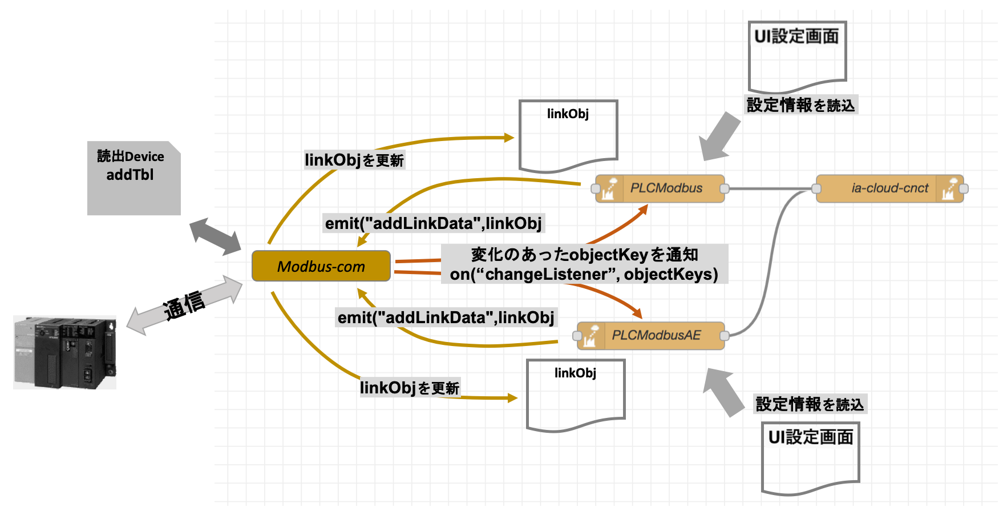

# PLC通信機器関連ノード

## PLC-modbus、PLC-modbus-AE、PLC-mitsubishi、PLC-Mitsubishi-AE
## Modbus-com、Mitsubishi-com

## 機能概要
これら一連のノードは、Modbus通信や三菱MCプロトコール通信を備えた各種の計測制御機器と通信を行い、それらの機器が保持するデータを読み出して、ia-cloud Center Server（CCS）へ格納するオブジェクトを生成して出力メッセージとして送出する。  
以下に、Modbus通信PLCを例にPLC Nodeと通信Nodeの、相互のメソッドコールとイベントリスナー登録・イベント発生の関連を示す。



#### PLC-Modbus, PLC-Mitsubishi  
PLCの持つビットデータ・ワードデータを読み出し、ia-cloudオブジェクトを生成するNode。  
PLC-Modbus NodeのcontentDataを設定する設定Node。ビット列、数値、文字列、数値列の自由な組み合わせでcontentDataを構成する設定が可能。
#### PLC-Modbus-AE, PLC-Mitsubishi-AE
PLCの持つビットデータを読み出し、アラーム＆イベント情報を持つia-cloudオブジェクトを生成するNode。
複数のcontentType="Alarm&Event"を持つcontentDataを設定できる。
#### Modbus-com, Mitsubishi-com
登録されたlinkObj（デバイスアドレスとデータ値等を保持する）から、Modbus通信のデバイスアドレステーブルを作成し、定期的にPLCとの通信を実行、データを取得してlinkObjを更新する設定Node。取得データに変化のあった場合に、登録されたchangeイベントを発行しリスナーを起動する。

### Node間のI/Fで使用されるオブジェクト　　

#### 設定オブジェクト：  
PLCのデータ項目とアラーム項目の設定情報を保持するオブジェクト構造。
```
{
  objectKey: "ユニークなオブジェクトキー",  // ユニークなオブジェクトキーの設定
  objectType: "iaCloudObject",          // 固定
  objectDescription: "説明",             // オブジェクト任意の説明
  storeInterval: 60,                    // 定期収集周期（秒）最小値10秒
  storeAsync: true,                     // オブジェクトのオプション
  dataItems: [
    { dataName: "データ名称",　 //　各DataItemの設定項目　下記の各itemTypeを参照
      itemType: "bit",
      deviceType: "Coil",
      address:123,
      number: 1,
      logic: "pos"
    }
}
```
データアイテムの設定オプション(bit列)
```
 {
    itemType: "bit",      // 取得するデータの種別、bit(ビット列)
    deviceType: "Coil",   // 取得するビットデータ列のあるデバイス種別（PLC機種依存）
    address:123,           // 取得するビットデータ列の先頭デバイスアドレス
    number: 1,            // 取得するビットデータ列のビット数
    logic: "pos"          // 取得するビットデータの論理（"pos"/"neg"）
  }
```
データアイテムの設定オプション(number)
```
dataObjects[i].ObjectContent.contentData[i].options = {
    itemType: "number",   // 取得するデータの種別、number(数値)
    deviceType: "IR",     // 取得するデータのあるデバイス種別（PLC機種依存）
    address:213,           // 取得するデータのあるデバイスアドレス
    type: "1w",           // 取得するデータの種別（1w:ワード、2w-b:ダブルワードビッグエンディアン、2w-l:ダブルワードリトルエンディアン）
    encode: "unsigned",   // 取得するデータの形式(unsigned:符号なし、signed:符号付、BCD:2進化10進)
    offset: 0,            // 取得するデータのゼロ点オフセット
    gain: 1               // 取得するデータの倍率
  }
```
データアイテムの設定オプション(string)
```
dataObjects[i].ObjectContent.contentData[i].options = {
    itemType: "string",   // 取得するデータの種別、string(文字列)
    deviceType: "IR",     // 取得する文字列のあるデバイス種別（PLC機種依存）
    address:123,           // 取得する文字列の先頭デバイスアドレス
    number: 1,            // 取得する文字列のワード数（文字数では無い、連続ワードデバイスの数）
    encode: "utf-8"       // 取得する文字列のエンコード（utf-8/sJIS/EUC）
  }
```
データアイテムの設定オプション(numList)
```
dataObjects[i].ObjectContent.contentData[i].options = {
    itemType: "numList",  // 取得するデータの種別、numList(数値列)
    deviceType: "HR",     // 取得するデータのあるデバイス種別（PLC機種依存）
    address:213,           // 取得するデータのあるデバイスアドレス
    number: 1,            // 取得するデータ列の数（ワード数では無い、連続データの数）
    type: "1w",           // 取得するデータの種別（1w:ワード、2w-b:ダブルワードビッグエンディアン、2w-l:ダブルワードリトルエンディアン）
    encode: "unsigned",   // 取得するデータの形式(unsigned:符号なし、signed:符号付、BCD:2進化10進)
  }
```
#### リンクオブジェクト(linkObj)：

各PLC NodeやPLC-AE Nodeは、このlinkObjをPLC通信Nodeにイベント通知することで、取得するPLCデータを登録できる。各PLC通信Nodeは、各PLC Nodeなどから登録されたLinkObjを統合し、重複を削除しソートを行い、効率的な通信単位に分割して、PLC通信を実施しLinkObjのデータを更新する。  
また、受信したデータに変化があった場合は、そのLinkObjを登録したNodeのChangeListnerイベントを発行し通知する。  
LinkObjのエントリーは、各PLC機種に依存しする。下記は、Modebus とPLC三菱シーケンサの例である。  
使用しないPLCメモリデバイスのエントリーは存在しなくてもかまわない。
```
{Coil:[linkData,], IS:[linkData], IR:[linkData,], HR:[linkData,]}

{M:[linkData,], X:[linkData], Y:[linkData,], L:[linkData,], SM:[linkData,], D:[linkData,], W:[linkData,]}
```
リンクデータ(linkData)  
複数のNodeやia-cloudオブジェクトから参照されるデバイスアドレスは、linkDataも複数存在する。
。  

```
{
    address: 0,       // Modbusデバイスアドレス
    value: "",        // 通信で取得された値(bitデバイス："0"/"1"、ワードデバイス："0xoooo"16ビットのHex表現文字列)
    preValue: "",     // 1回前の取得データ
    nodeId: null,     // このリンクデータを利用するNodeのID
    objectKey: ""     // このリンクデータを利用するia-cloudオブジェクトのobjectKey
}
```
