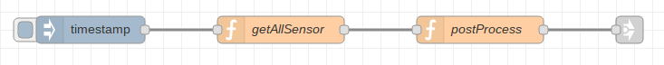
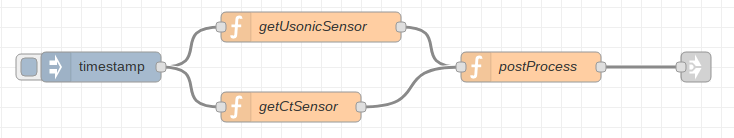

# RaspberryPi-sensor
ラズベリーパイでのセンサからのデータ取得のNodeについて。
仕様策定にあたり、処理方法を整理する。

1. センサからのデータ取得方法

   現在の想定では電流センサと超音波距離測定センサの2種類のセンサが存在する。データの取得方法について下記の通り選択肢がある。

   1. 電流センサと超音波距離測定センサのデータを一つのNodeで取得する。

      * メリット

        入力Nodeから出力Nodeまでのフローが一つになるので、フローがシンプルになる。

      * デメリット

        RaspberryPIの仕様の変更やセンサーの変更・増設のたびに、取得Node自体に記述する必要がある。

      

      

   2. 電流センサ取得Nodeと超音波距離測定センサ取得Nodeを分ける。

      * メリット

        センサごとに取得Nodeを配置するため、RaspberryPIの仕様変更やセンサの変更・増設の際に、Node配置とパラメータ設定で対応できる。(新規センサー種の増設の場合は、Node作成の必要あり。)

      * デメリット

        入力Nodeから複数の機能Nodeに分かれてデータ取得をするため、後続のNodeにバラバラのタイミングで取得データが出力される。出力Nodeに至る手前で同一取得グループとしてまとめる処理が必要となる。

      

      

2. データ取得後の"postProcess"の処理と、"ia-cloud-cnct"へ渡すデータの方式について。

   1. 取得ごとに渡す。

      * メリット

        リアルタイム処理となるので、コードがシンプルになる。センサ取得Nodeがセンサごとにした場合(1-ii)は、メッセージのAggregation処理が必要。

      * デメリット

        複数回取得データの集計処理ができない。センサ取得回数分、cloudへの接続回数となる。

   2. 一旦データファイルに格納してから渡す。

      * メリット

        複数回取得データに集計処理をかけることが可能。データをまとめてから送信することで、cloudへの接続回数を減らすことが可能。

      * デメリット

        データ送信のための処理が別途必要となる。

      

      

## 機能概要

本Nodeはラズベリーパイに接続されたセンサからデータを取得する。


## 入力メッセージ

* timestamp:  取得タイミングの同期用。


## プロパティー

本Nodeは以下のプロパティを持つ

| 名称              |  種別  | 説明                                           |
| ----------------- | :----: | ---------------------------------------------- |
| Node名称          | string | Nodeの名称                                     |
| センサー種類      | string | 読み取るセンサーの種類<br />ex. "ct", "usonic" |
| GPIOの端子1の指定 | number | RaspberryPIのGPIOの端子番号1                   |
| GPIOの端子1の種別 | string | 端子番号1につける種別                          |
| GPIOの端子2の指定 | number | RaspberryPIのGPIOの端子番号2                   |
| GPIOの端子2の種別 | string | 端子番号2につける種別                          |


## 出力メッセージ

* ``payload``:  **object**
  * ユーザ名どうするか？

```
msg.payload = {
	"ID" : { string } ,
	"timestamp" : { string } ,
	"取得グループID" : { string },
	"センサー種類" : { string },
	"取得したセンサーの値" : { string }
}
```

