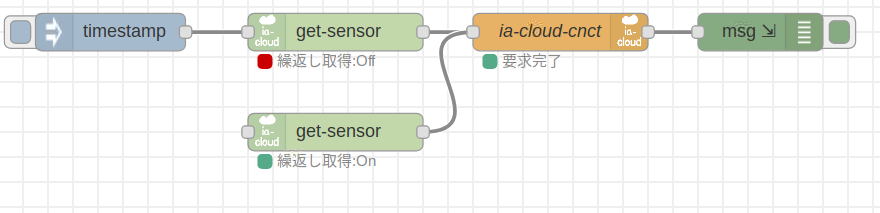
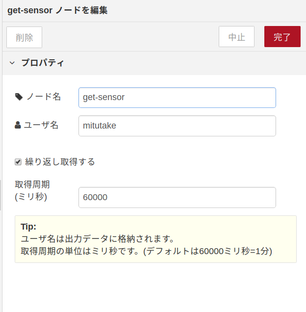

# RaspberryPi-sensor データ取得ノード

## get-sensor

## 機能概要

このノードは、RaspberryPIに接続されたセンサーから現在の値を取得する。

#### 動作方法について：

- 本ノード単独で自動実行(プロパティて繰り返し設定をすることにより実行)
- injectionノードからのtimestamp信号をトリガーとしての実行

取得エラーの定義と取り扱いについては検討中。

### 電流センサー

電流センサー(CTセンサー：SR-3702)を使い、コンセントに流れている電流のデータを取得する。
センサーへの通信を行い、センサーが得ている電流の値をV単位で取り出す。

### 超音波距離測定センサー

超音波距離測定センサー(HC-SR04)を使い、距離データを取得する。
センサーへ起動信号を送り、センサーの状態から距離情報をcm単位で取りだす。


## スクリーンショット

フロー画面




設定画面




## 入力メッセージ

* timestamp:  本ノードの実行のトリガーとなる。


## プロパティー

本Nodeは以下のプロパティを持つ

| 名称     |  種別   | 説明                                                         |
| -------- | :-----: | ------------------------------------------------------------ |
| name     | string  | Nodeの名称                                                   |
| user     | string  | 利用者                                                       |
| repeat   | boolean | 繰り返し取得するかの設定<br />(設定をOnにすることにより、本ノード単独で取得動作が実行される) |
| interval | number  | 繰り返しの際の周期(ミリ秒)                                   |


## 出力メッセージ

* ``msg``:  **object**
  * 取得した値を配列に格納する。

| 名称      | 種別   | 説明                                                         |
| --------- | ------ | ------------------------------------------------------------ |
| timestamp | string | タイムスタンプ(isodatetime)<br />※入力メッセージのtimestampではなく、本ノード内で新たに取得したtimestamp。 |
| user      | string | 利用者                                                       |
| volts     | string | 電流センサーで計測した電圧(V)                                |
| distance  | string | 距離測定センサーで計測した距離(cm単位)                       |


```
msg = {
    "request": "store",
    "dataObject": {
        "objectType" : "iaCloudObject",
        "objectKey" : "rmc-iot-santama." + {user} + ".nrct-sensors" ,
        "objectDescription" : "センサーの値",
        "timeStamp" :  {timestamp},
        "ObjectContent" : {
            "contentType": "com.ia-cloud.contenttype.hackathon2017.temp01",
            "contentData":[{
                "commonName": "Column1",
                "dataName": "CTセンサー",
                "dataValue": {volts},
                "unit": "V"
            },{
                "commonName": "Column2",
                "dataName": "超音波センサー",
                "dataValue": {distance},
                "unit": "cm"
            },{
                "commonName": "Column3",
                "dataName": "ダミー",
                "dataValue": 0,
                "unit": "value"
            },{
                "commonName": "Column4",
                "dataName": "ダミー",
                "dataValue": 0,
                "unit": "value"
            },{
                "commonName": "Column5",
                "dataName": "ダミー",
                "dataValue": 0,
                "unit": "value"
            },{
                "commonName": "Column6",
                "dataName": "ダミー",
                "dataValue": 0,
                "unit": "value"
            }]
        }
    }
}


```

