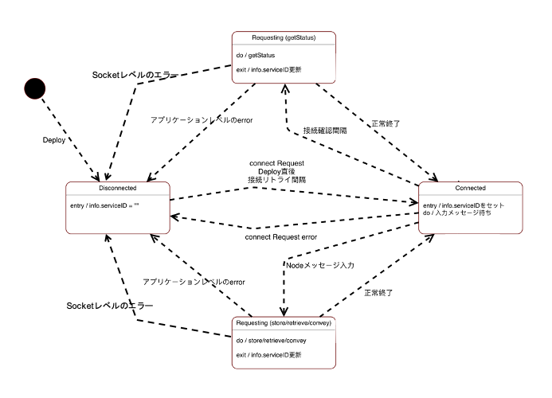

# ia-cloud接続ノード

## ia-cloud-cnct

## 機能概要

本nodeは、起動時（デプロイ時）に設定された自身のプロパティに従い、ia-cloudサーバ(CCS)へ接続**connect**リクエストをこない、serviceIDを取得する。  
Flowの終了時には、接続されている ia-cloudサーバに対し、**terminate** リクエストを発行して接続を終了しする。  
入力メッセージを受け取ると、その内容に応じて、ia-cloud Web API を使って、CCSに対するレクエストを発行し、そのレスポンスを確認して、serviceIDの更新を実施する。  
ia-cloudサーバとの通信でエラーが発生した場合の動作については、以下の状態遷移図に基づき状態が遷移する。状態遷移図にあるconnectのリトライ間隔や、getStatusによる接続確認間隔は、プロパティの詳細設定項目で設定できる。




## 入力メッセージ

- ``msg.request``: ia-cloud CCSへのリクエスト。"store" "retrieve" "convey" のいずれか。
- ``msg.dataObject``: ia-cloud CCSへのリクエストで送出するオブジェクト。
  - "store":の場合、ストアすべきia-cloudオブジェクトあるいはia-cloudオブジェクトアレー
  - "retrieve"の場合、取り出すia-cloudオブジェクトの、objectKey,timestamp,instanceKeyをメンバとするオブジェクト
  - "convey"の場合、搬送すべき通信伝聞搬送モデルのia-cloudオブジェクト

例
 ```
{
  "request": "store",
  "dataObject": {
      "objectType" : "iaCloudObject",
      "objectKey" : { string } ,
      "objectDescription" : { string },
      "timestamp" : { string },
      "objectContent" : { iaCloudObjectContent }
  }
}
 ```

## プロパティー

本nodeは以下のプロパティを持つ

| 名称 | 種別 | 説明 |
|:----------|:-----:|:--------------------|
|ia-cloudサーバの名前|string|このNodeインスタンスの名称。接続先のia-cloud CCSの名称。|
|ia-cloudサーバurl|string|接続先の ia-cloudサーバのurl。|
|ID|string|接続先の ia-cloudサーバの認証用のID。|
|パスワード|string|接続先の ia-cloudサーバの認証用のパスワード。|
|データソースキー|string|このデータソース(FDS)につけるユニークなキー|
|コメント|string|このデータオブジェクトソース(FDS)につけるコメント|
|CCS接続リトライ間隔|number|CCSへの接続が切断された時のリトライ間隔。分単位で設定。0はリトライを行わない。|
|接続確認間隔|number|CCSへの接続の確認のため、リクエストがなくとも、getStausリクエストを送出する間隔を、時間単位で設定。0は接続確認を行わない。|

## 出力メッセージ

* ``payload``:  **object**  
ia-cloudサーバへconnectやstoreなどのリクエストをした結果、返されたJSON文字列。下位レベルのエラーがなければ、以下に示すレスポンスボディのJSONをparseしたobjectが出力される。  

* 入力メッセージの、**msg.request**、**msg.object** もそのまま出力メセージに含まれる。

**connectリクエストの場合**
```
msg.payload = {
	"userID" : { string } ,
	"FDSKey" : { string } ,
	"FDSType" : "iaCloudFDS",
	"serviceID" : { string }
}
```

**storeリクエストの場合**
```
msg.payload = {
    "serviceID": { string } ,
    "status" : { string },
    "newServiceID": { string },
    "optionalMessage" : {object}
}

```
