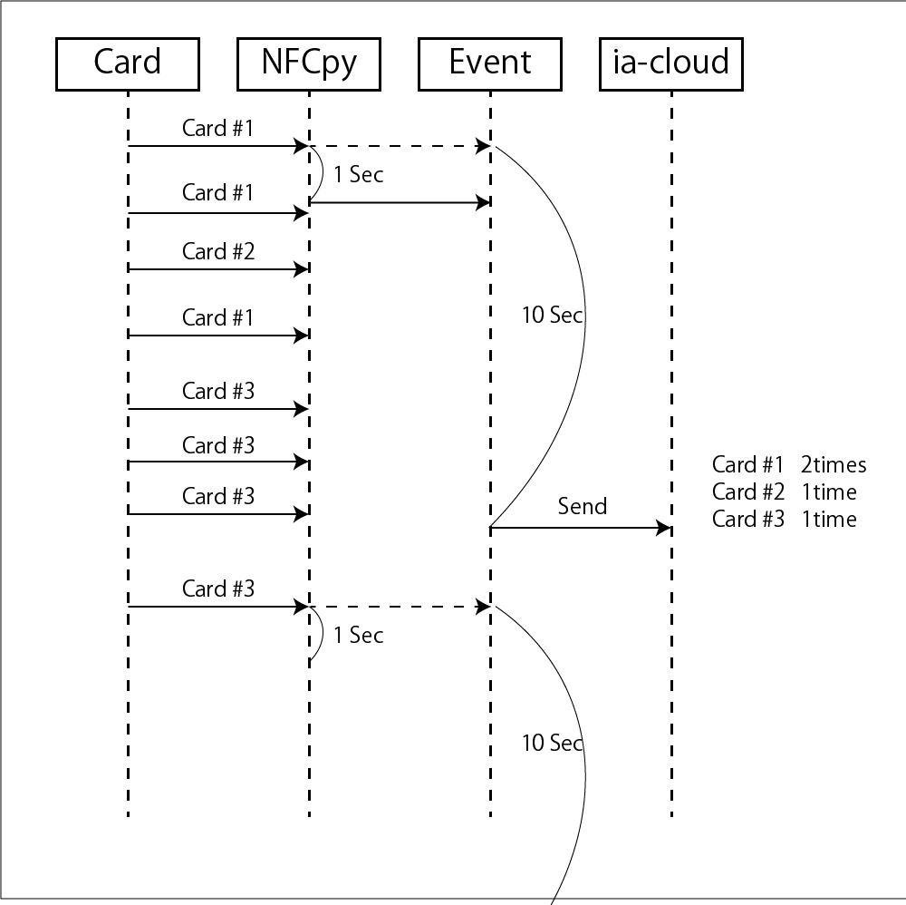

# ia-cloud-nfcpy-id

Read the card ID (Mifare: UID, FeliCa: IDm) with `node-nfcpy-id`.

## Install

Requires the nfcpy module in advance.  
Install the nfcpy module with pip command.  

```
pip install -U nfcpy
```

## PaSoRi Setting

1.Connect the PaSoRi to the USB port of RaspberryPI.  
  

2.Execute lsusb command to get the PaSoRi Vendor ID and Product ID .  

```
@raspberrypi:~ $ lsusb
　　　・
　　　・
Bus 001 Device 005: ID 054c:06c3 Sony Corp.
```

In this case,"054c" is Vendor ID, and "06c3" is Product ID.  


3.Add the rule for PaSoRi.

```
sudo sh -c 'echo SUBSYSTEM==\"usb\", ACTION==\"add\",  
  ATTRS{idVendor}==\"054c\", ATTRS{idProduct}==\"06c3\",  
  GROUP=\"plugdev\" >> /etc/udev/rules.d/nfcdev.rules'
```


## License
See [license](https://github.com/ia-cloud/node-red-contrib-ia-cloud-fds/blob/master/LICENSE) (Apache License Version 2.0).

## Function  


