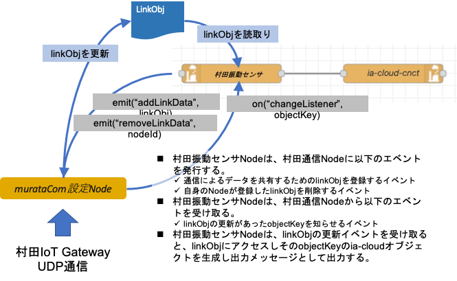

# 村田振動センサノード

## murata-sensor
## murata-com（設定Node）

## 機能概要
村田製作所製の無線振動センサのデータを、ゲートウエイ機器から取得し、ia-cloudオブジェクトを生成するノード。センサのデータ測定間隔とFFT解析の有効・無効を設定できる。
以下に、 村田振動センサNodeと、村田IoTGatewayとの通信を行う設定Nodeの、相互のメソッドコールとイベントリスナー登録・イベント発生の関連を示す。



#### murata-com
センサNodeからの設定に基づき、村田IoTGatewayとUDP/IPを用いて通信し、振動センサのデータを取得してセンサNodeとの共有データオブジェクトlinkDataを更新する設定Node。データの更新があった場合に、センサNodeにchangeListenerイベントを発行する。

#### murata-sennsor
設定Nodemurata-comに対し、取得すべきセンサIDや収集周期・FFT分析の有効無効を設定し、収集データを共有するためのLinkDataオブジェクトを登録する。登録されたLinkDataが更新された際に発行されるchangeListenerイベントを受信し、linkDataからデータを読み出して設定に基づきia-cloudオブジェクトを生成、出力メッセージとして送出する。
設定の自動更新Nodeから、更新すべき設定オブジェクトが入力された場合、自身が登録したlinkDataを削除する、removeLinkDtataイベントを設定Nodeに発行し、新しい設定情報に基づき新しいlinkDataを生成して、設定Nodeへ登録する。

### センサNodeの設定情報（UI設定・設定ファイル・自動更新）
センサNodeのNode設定は、Node-REDエディタによるUI画面での設定と、（ブラウザ上でNode-REDエディタを起動しているPC上の）ローカルファイルかクリップボードから読み込んだJSON表記の設定オブジェクトによる設定を選択できる。また、この設定オブジェクトはia-cloud設定更新Nodeからのメッセージ入力によって更新することも可能であり、ia-cloud CCS から自動で更新された設定オブジェクトを取得し設定することができる。

#### UI画面設定での設定オブジェクト
 
設定オブジェクト構造。
```
{
  murataCom: "2af696f1.eecbba"          // 使用する村田通信設定Nodeのid
  objectKey: "ユニークなオブジェクトキー",  // ユニークなオブジェクトキーの設定
  objectDescription: "説明",             // オブジェクト任意の説明
  interval: "1h",                       // 村田センサに設定するデータ収集周期を表す文字列。15秒から24時間の12段階
  sennsorID: "9E47",                    // 村田センサに個別に付与された、16進4桁の文字列
  enableFFT: "false",                   // FFT分析を使用するか
  contentType: "iaCloudData"            // ia-cloudのcontentType
  itemList: [{itemData}]                // センサデータに関する設定項目
  autoConf: false,                      // 自動瀬定更新を使用するか
  name: "このノードの個別名称"              // ノードに付与する個別の名称
}
```
itemDataの構造（各データ項目に付与するデータ名称）
通常は、エディタで設定されるデフォルトの名称を使用する。fftのエントリーは、FFT分析の有効無効の切り替えのためのフラグとして使用するもので、固定である。
```
[
  {dItem: "rms", dataName: "", fft: false},
  {dItem: "sharpness", dataName: "", fft: false},
  {dItem: "bttry", dataName: "", fft: false},
  {dItem: "temp", dataName: "", fft: false},
  {dItem: "rssi", dataName: "", fft: false},
  {dItem: "freq1", dataName: "", fft: true},
  {dItem: "acce1", dataName: "", fft: true},
  {dItem: "freq2", dataName: "", fft: true},
  {dItem: "acce2", dataName: "", fft: true},
  {dItem: "freq3", dataName: "", fft: true},
  {dItem: "acce3", dataName: "", fft: true},
  {dItem: "freq4", dataName: "", fft: true},
  {dItem: "acce4", dataName: "", fft: true},
  {dItem: "freq5", dataName: "", fft: true},
  {dItem: "acce5", dataName: "", fft: true}
]
```
#### ファイル設定での設定オブジェクト
ファイル設定を選択した場合の、Nodeの設定情報
```
{
  murataCom: "2af696f1.eecbba"          // 使用する村田通信設定Nodeのid
  configObjects: "application/jsonのデータ"  // センサNodeの設定オブジェクト
  autoConf: false,                      // 自動瀬定更新を使用するか
  name: "このノードの個別名称"              // ノードに付与する個別の名称
}
```
configObjctsの構造.
複数のセンサ、objecyKeyの設定を配列に記述ができる構造である。
```
[
  {
    objectKey: "ユニークなオブジェクトキー",  // ユニークなオブジェクトキーの設定
    objectDescription: "説明",             // オブジェクト任意の説明
    interval: "1h",                       // 村田センサに設定するデータ収集周期を表す文字列。15秒から24時間の12段階
    sennsorID: "9E47",                    // 村田センサに個別に付与された、16進4桁の文字列
    enableFFT: "false",                   // FFT分析を使用するか
    contentType: "iaCloudData"            // ia-cloudのcontentType
    itemList: [
      {dItem: "rms", dataName: "", fft: false},
      {dItem: "sharpness", dataName: "", fft: false},
      {dItem: "bttry", dataName: "", fft: false},
      {dItem: "temp", dataName: "", fft: false},
      {dItem: "rssi", dataName: "", fft: false},
      {dItem: "freq1", dataName: "", fft: true},
      {dItem: "acce1", dataName: "", fft: true},
      {dItem: "freq2", dataName: "", fft: true},
      {dItem: "acce2", dataName: "", fft: true},
      {dItem: "freq3", dataName: "", fft: true},
      {dItem: "acce3", dataName: "", fft: true},
      {dItem: "freq4", dataName: "", fft: true},
      {dItem: "acce4", dataName: "", fft: true},
      {dItem: "freq5", dataName: "", fft: true},
      {dItem: "acce5", dataName: "", fft: true}
    ]
  },
  {
    objectKey: "ユニークなオブジェクトキー",  // ユニークなオブジェクトキーの設定
    objectDescription: "説明",             // オブジェクト任意の説明
    interval: "1h",                       // 村田センサに設定するデータ収集周期を表す文字列。15秒から24時間の12段階
    sennsorID: "72C1",
          |
          |
          |
          
  }
]
```

#### リンクオブジェクト(linkObj)：

センサNodeは、このlinkObjを村田通信設定Nodeにイベント通知することで、取得するPセンサデータを登録できる。村田通信設定Nodeは、複数のセンサNodeから登録されたLinkObjを統合し、村田IoTGatewayのUDP通信を実施し各センサのデータ収集間隔とFFT分析の有無を設定する。また各センサIDのセンサからのデータ通信を受信し、linkObjのデータを更新し、そのlinkObjを登録したNodeのChangeListnerイベントを発行し通知する。  

リンクデータ(linkData)  
```
linObj = {
  nodeID: node.id,
  links: [linkData, . . .   ]
}
```
linkDataの構造は以下の通りである
```
linkData = {
  objectKey: "key",
  sensorId: "8A6C",
  inteval: "1h",
  enableFFT: true,
  rms: value,
  sharpness: value,
  bttry: value,
  temp: value,
  rssi: "value",
  freq1: "value",
  acce1: "value",
  freq2: "value",
  acce2: "value",
  freq3: "value",
  acce3: "value",
  freq4: "value",
  acce4: "value",
  freq5: "value",
  acce5: "value"
} 
```